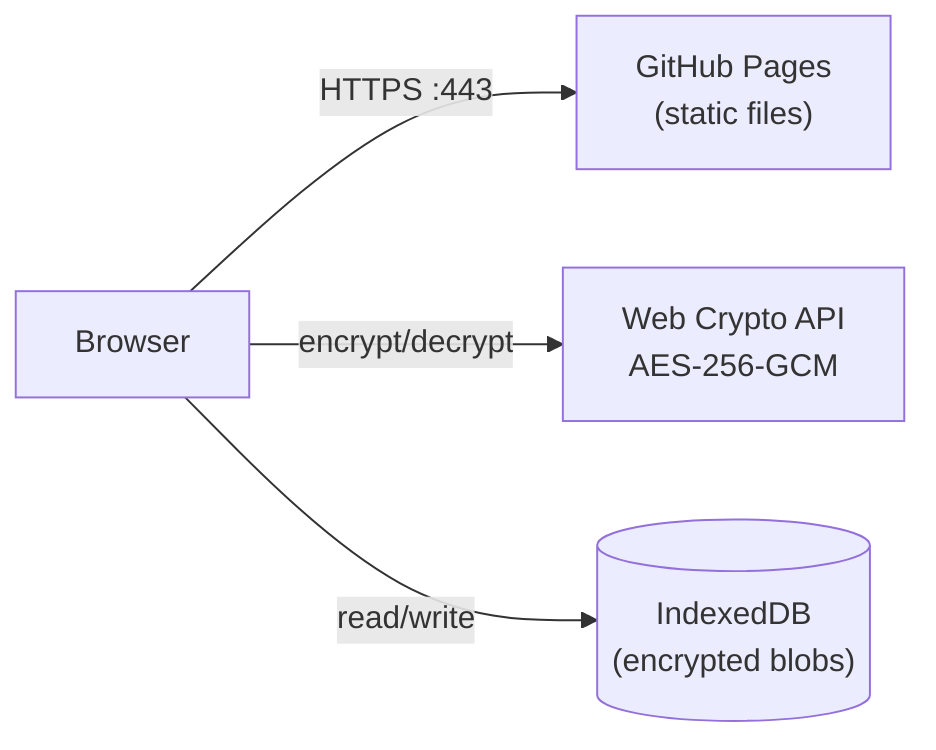

# PeopleSafe SDLC Journal

A client-side encrypted journaling app for IT and cybersecurity professionals. Built on the SDLC framework — **Success, Delight, Learning, Compliment** — adapted from Donald Altman's G.L.A.D. Technique.

**Live at:** [https://sdlc.circle6systems.com](https://sdlc.circle6systems.com)

## Features

- **Daily SDLC Journaling** — Four focused reflections: Success, Delight, Learning, Compliment
- **Client-Side Encryption** — AES-256-GCM with PBKDF2 key derivation (600,000 iterations). Data never leaves your browser.
- **Rollup Summaries** — Weekly, monthly, quarterly, and yearly aggregations with editable reflections
- **Browse & Search** — Full-text search across all encrypted entries (decrypt-then-search, entirely local)
- **Export/Import** — JSON backup and restore for data portability
- **Zero Network Requests** — After initial page load, the app makes no network requests whatsoever
- **Mobile Responsive** — Full functionality on mobile with bottom navigation
- **Auto-Lock** — Session automatically locks after 5 minutes of tab inactivity

## Architecture

The app runs entirely in the browser with no backend. User data is encrypted before storage and decrypted only in memory during an active session.



For the full system design, data flow diagrams, and storage schema, see [docs/ARCHITECTURE.md](docs/ARCHITECTURE.md).

## Privacy Commitment

- All encryption/decryption happens in your browser using the Web Crypto API
- Your passphrase is never stored — only a verification hash (PBKDF2, separate salt)
- No cookies, no analytics, no telemetry, no server-side processing
- IndexedDB stores only encrypted blobs
- The master encryption key exists only in JavaScript memory and is cleared on page unload
- Content Security Policy restricts all external connections

For the full threat model and security controls, see [docs/SECURITY.md](docs/SECURITY.md).

## Technology

- **Alpine.js 3.x** (vendored, no CDN) — Reactive UI without build tools
- **Web Crypto API** — AES-256-GCM encryption, PBKDF2 key derivation
- **IndexedDB** — Persistent encrypted storage (50MB+)
- **GitHub Pages** — Static hosting, no server required
- **Zero dependencies** — No build step, no npm, no bundler

For the complete component inventory, see [SBOM.md](SBOM.md).

## Getting Started

1. Open [sdlc.circle6systems.com](https://sdlc.circle6systems.com) in a modern browser
2. Create a passphrase (minimum 12 characters) — this derives your encryption key
3. Write your daily SDLC entry
4. Review rollup summaries to spot patterns over time
5. Export backups regularly from Settings

**Important:** If you forget your passphrase, your data cannot be recovered. There is no reset mechanism by design.

## Local Development

No build tools required. Serve the repository root with any static HTTP server.

```bash
cd sdlc-journal
python3 -m http.server 8000
# Open http://localhost:8000
```

For coding conventions and how to extend the app, see [docs/DEVELOPER_GUIDE.md](docs/DEVELOPER_GUIDE.md).

## Documentation

| Document | Description |
|----------|-------------|
| [docs/ARCHITECTURE.md](docs/ARCHITECTURE.md) | System design, data flow, crypto architecture, storage schema |
| [docs/SECURITY.md](docs/SECURITY.md) | Threat model, encryption controls, CSP, incident response |
| [docs/DEPLOYMENT.md](docs/DEPLOYMENT.md) | GitHub Pages, CI/CD pipeline, custom domain, troubleshooting |
| [docs/DEVELOPER_GUIDE.md](docs/DEVELOPER_GUIDE.md) | Coding conventions, module patterns, extending the app |
| [docs/FRONTEND.md](docs/FRONTEND.md) | Alpine.js architecture, view states, CSS design system |
| [SBOM.md](SBOM.md) | Software Bill of Materials |
| [SDLC-2.md](SDLC-2.md) | The SDLC journaling technique — methodology and practice |

## About

The SDLC technique is a mental health resource for IT professionals, adapting positive psychology practices to the unique challenges of technology and cybersecurity work. See [SDLC-2.md](SDLC-2.md) for the full technique description.

A [Circle 6 Systems](https://circle6.systems) initiative for psychological safety in IT.
