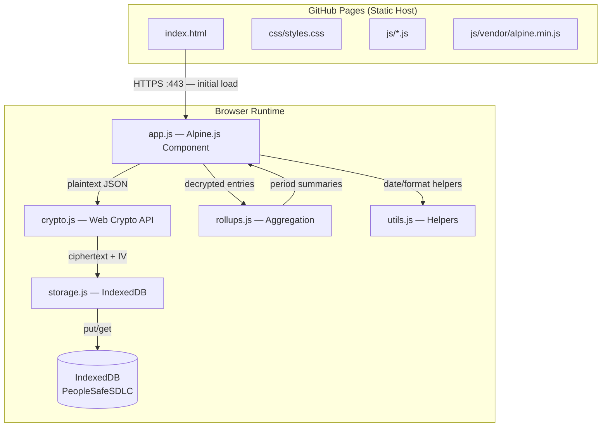
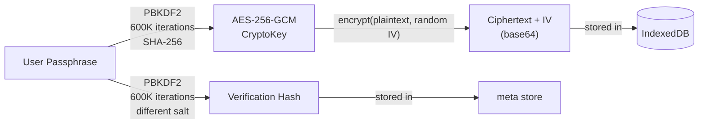
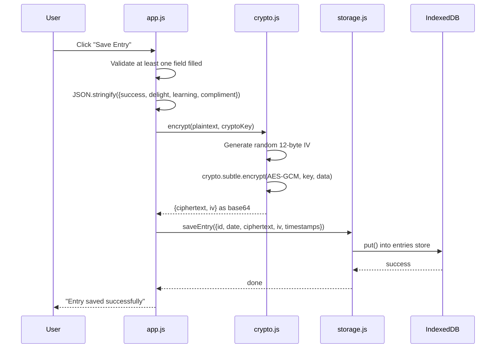

# Architecture

PeopleSafe SDLC Journal is a zero-backend single-page application. All logic — encryption, storage, rendering — runs entirely in the user's browser. There is no server-side processing, no API calls after page load, and no external dependencies at runtime.

## System Overview

The following diagram shows how the major modules interact during a typical session. All data paths stay within the browser; the only network interaction is the initial static file load from GitHub Pages.

## Module Responsibilities

The application consists of five JavaScript modules, each exposed as a global IIFE namespace. There is no build step or module bundler — scripts load synchronously in dependency order, with Alpine.js deferred to run last.

| Module | Global | Responsibility |
|--------|--------|----------------|
| `js/utils.js` | `Utils` | Date arithmetic (ISO 8601 weeks), display formatters, `escapeHtml`, `debounce`, `truncate` |
| `js/crypto.js` | `Crypto` | PBKDF2 key derivation, AES-256-GCM encrypt/decrypt, passphrase hashing, feature detection |
| `js/storage.js` | `Storage` | IndexedDB lifecycle, CRUD for entries/rollups/meta, export/import, storage estimates |
| `js/rollups.js` | `Rollups` | Period aggregation (weekly/monthly/quarterly/yearly), sub-period reflection retrieval |
| `js/app.js` | *(Alpine data)* | State machine, auth flow, view logic, session management, template helpers |

## Cryptographic Architecture

Encryption is the core architectural concern. The design uses a single master key per session with a unique random initialization vector (IV) per encrypt operation, which is cryptographically sound for AES-GCM.

**Key derivation** happens once at authentication. The passphrase is imported as a PBKDF2 base key, then derived into a non-extractable `CryptoKey` object. Two separate salts are used: one for the encryption key, one for the verification hash. This prevents the verification hash from leaking information about the encryption key.

**Encryption** uses `crypto.subtle.encrypt` with a fresh 12-byte IV generated via `crypto.getRandomValues` for every operation. The ciphertext and IV are base64-encoded and stored together in IndexedDB. The CryptoKey object is held in a JavaScript variable and never serialized or persisted.

**Session lifecycle**: the CryptoKey is cleared on `beforeunload` and on manual lock. A `visibilitychange` listener triggers auto-lock after 5 minutes of tab inactivity.

## Storage Schema

All persistent data lives in a single IndexedDB database named `PeopleSafeSDLC` (version 1) with three object stores.

**`entries` store** — one record per journal day, keyed by ISO date.

| Field | Type | Description |
|-------|------|-------------|
| `id` | string | `YYYY-MM-DD` (keyPath) |
| `date` | string | Same as id; indexed for range queries |
| `ciphertext` | string | Base64-encoded AES-GCM ciphertext of JSON `{success, delight, learning, compliment}` |
| `iv` | string | Base64-encoded 12-byte IV |
| `createdAt` | string | ISO 8601 timestamp |
| `updatedAt` | string | ISO 8601 timestamp |

**`rollups` store** — one record per reflection period, keyed by type-prefixed period key.

| Field | Type | Description |
|-------|------|-------------|
| `id` | string | `{type}:{periodKey}` e.g. `weekly:2026-W09` (keyPath) |
| `type` | string | `weekly` / `monthly` / `quarterly` / `yearly`; indexed |
| `periodKey` | string | ISO period key e.g. `2026-W09`, `2026-03`, `2026-Q1`, `2026` |
| `ciphertext` | string | Base64-encoded encrypted reflection text |
| `iv` | string | Base64-encoded 12-byte IV |
| `createdAt` | string | ISO 8601 timestamp |
| `updatedAt` | string | ISO 8601 timestamp |

**`meta` store** — key-value pairs for authentication material.

| Key | Value |
|-----|-------|
| `keySalt` | Base64-encoded 16-byte salt for encryption key derivation |
| `passphraseSalt` | Base64-encoded 16-byte salt for verification hash |
| `passphraseHash` | Base64-encoded PBKDF2 hash for passphrase verification |

## Data Flow: Save Entry

This sequence shows the complete path from user input to persistent encrypted storage when saving a daily journal entry.

## Design Decisions

| Decision | Choice | Rationale |
|----------|--------|-----------|
| No backend | Static files only | Privacy guarantee — data physically cannot leave the browser |
| IndexedDB over localStorage | IndexedDB | 50MB+ quota vs 5-10MB; async API; structured storage for encrypted blobs |
| Vendored Alpine.js | No CDN | Zero network requests after page load; privacy commitment; no third-party tracking |
| Single master key | One PBKDF2 derivation per session | Per-entry derivation would cost 200-500ms each; unique IVs per operation are sufficient for AES-GCM |
| Rollup auto-content on-the-fly | Decrypt and aggregate at view time | Avoids stale cached summaries; 365 decrypts takes ~200ms on modern hardware |
| Manual entry save | Explicit button click | Aligns with deliberate journaling practice; avoids accidental partial saves |
| Debounced reflection save | Auto-save after 1.5s pause | Longer-form writing where losing work would be frustrating |
| IIFE modules | No bundler, no ES modules | Zero build tooling; works directly on GitHub Pages; simple dependency chain |

## Browser Requirements

The app requires these Web APIs, supported in all modern browsers (Chrome 60+, Firefox 57+, Safari 11+, Edge 79+):

- **Web Crypto API** (`crypto.subtle`) for PBKDF2 and AES-GCM
- **IndexedDB** for persistent storage
- **TextEncoder / TextDecoder** for UTF-8 string handling
- Feature detection runs at init; unsupported browsers see an explanatory message
