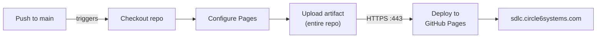

# Deployment

PeopleSafe SDLC Journal is a static site deployed to GitHub Pages. There is no build step, no server provisioning, and no runtime infrastructure to manage. The CI/CD pipeline is a single GitHub Actions workflow that uploads the repository contents as a Pages artifact.

## Hosting Environment

| Aspect | Detail |
|--------|--------|
| Host | GitHub Pages |
| Repository | `jeff-is-working/SDLC-Journal` |
| Custom domain | `sdlc.circle6systems.com` |
| HTTPS | Enforced by GitHub Pages |
| Build type | GitHub Actions workflow |
| Branch | `main` |
| Artifact path | `.` (repository root) |

The `CNAME` file in the repository root tells GitHub Pages to serve the site at the custom domain. The `.nojekyll` file disables Jekyll processing so that files and directories starting with underscores are served correctly.

## CI/CD Pipeline

The deployment workflow lives at `.github/workflows/static.yml`. It triggers on every push to `main` and can also be triggered manually via `workflow_dispatch`.

The workflow uses four official GitHub Actions: `actions/checkout@v4`, `actions/configure-pages@v5`, `actions/upload-pages-artifact@v3`, and `actions/deploy-pages@v4`. Concurrency is set to the `pages` group with `cancel-in-progress: false` to prevent deployment races.

Required repository permissions (set in the workflow): `contents: read`, `pages: write`, `id-token: write`.

## Custom Domain Setup

The custom domain requires a DNS CNAME record and the GitHub Pages configuration to match.

**DNS record** (configured at your DNS provider for `circle6systems.com`):

| Type | Name | Value |
|------|------|-------|
| CNAME | `sdlc` | `jeff-is-working.github.io` |

**GitHub side**: The `CNAME` file in the repository root contains `sdlc.circle6systems.com`. GitHub Pages reads this file and configures the custom domain automatically. HTTPS is enforced via GitHub's automatic Let's Encrypt certificate provisioning.

For setup and local development instructions, see [README.md](../README.md#local-development).

## Troubleshooting

| Symptom | Cause | Resolution |
|---------|-------|------------|
| Site shows 404 after push | GitHub Actions workflow not triggered | Check Actions tab; verify `static.yml` exists on `main`; manually trigger via `workflow_dispatch` |
| Custom domain not resolving | DNS CNAME not propagated | Verify CNAME record points to `jeff-is-working.github.io`; allow up to 24h for DNS propagation; check with `dig sdlc.circle6systems.com` |
| HTTPS certificate error | GitHub hasn't provisioned the cert yet | Wait 15-30 minutes after DNS propagation; check repo Settings > Pages for certificate status |
| `CNAME` file disappears after deploy | Workflow artifact doesn't include it | Ensure `CNAME` is committed to the `main` branch and not in `.gitignore` |
| Old content served after deploy | CDN cache | GitHub Pages has a 10-minute cache; hard-refresh with Ctrl+Shift+R; wait and retry |
| Workflow fails at "Upload artifact" | File too large or permissions issue | Check Actions logs; verify repository size is under GitHub Pages limits (1GB published site) |
