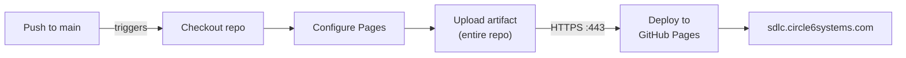
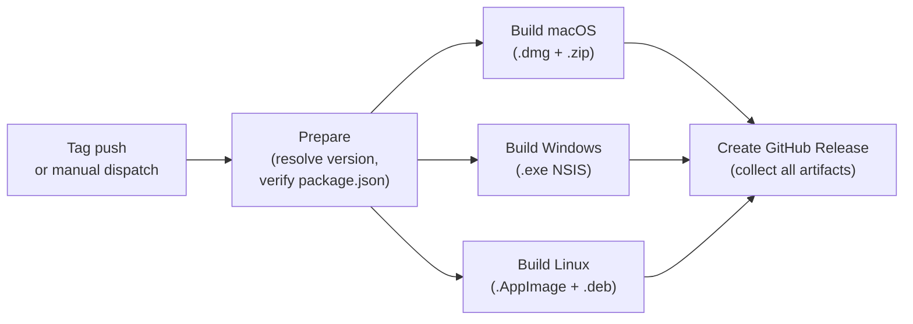

# Deployment

PeopleSafe SDLC Journal is deployed two ways: as a static site on GitHub Pages (web) and as a packaged Electron app (desktop). The web deployment has no build step. The desktop deployment uses electron-builder to produce platform-specific installers distributed via GitHub Releases.

## Hosting Environment

| Aspect | Detail |
|--------|--------|
| Host | GitHub Pages |
| Repository | `jeff-is-working/SDLC-Journal` |
| Custom domain | `sdlc.circle6systems.com` |
| HTTPS | Enforced by GitHub Pages |
| Build type | GitHub Actions workflow |
| Branch | `main` |
| Artifact path | `.` (repository root) |

The `CNAME` file in the repository root tells GitHub Pages to serve the site at the custom domain. The `.nojekyll` file disables Jekyll processing so that files and directories starting with underscores are served correctly.

## CI/CD Pipeline

The deployment workflow lives at `.github/workflows/static.yml`. It triggers on every push to `main` and can also be triggered manually via `workflow_dispatch`.

```mermaid
graph LR
    PUSH["Push to main"] -->|"triggers"| CHECKOUT["Checkout repo"]
    CHECKOUT --> CONFIGURE["Configure Pages"]
    CONFIGURE --> UPLOAD["Upload artifact\n(entire repo)"]
    UPLOAD -->|"HTTPS :443"| DEPLOY["Deploy to\nGitHub Pages"]
    DEPLOY --> LIVE["sdlc.circle6systems.com"]
```

The workflow uses four official GitHub Actions: `actions/checkout@v4`, `actions/configure-pages@v5`, `actions/upload-pages-artifact@v3`, and `actions/deploy-pages@v4`. Concurrency is set to the `pages` group with `cancel-in-progress: false` to prevent deployment races.

Required repository permissions (set in the workflow): `contents: read`, `pages: write`, `id-token: write`.

## Custom Domain Setup

The custom domain requires a DNS CNAME record and the GitHub Pages configuration to match.

**DNS record** (configured at your DNS provider for `circle6systems.com`):

| Type | Name | Value |
|------|------|-------|
| CNAME | `sdlc` | `jeff-is-working.github.io` |

**GitHub side**: The `CNAME` file in the repository root contains `sdlc.circle6systems.com`. GitHub Pages reads this file and configures the custom domain automatically. HTTPS is enforced via GitHub's automatic Let's Encrypt certificate provisioning.

For setup and local development instructions, see [README.md](../README.md#local-development).

## Troubleshooting

| Symptom | Cause | Resolution |
|---------|-------|------------|
| Site shows 404 after push | GitHub Actions workflow not triggered | Check Actions tab; verify `static.yml` exists on `main`; manually trigger via `workflow_dispatch` |
| Custom domain not resolving | DNS CNAME not propagated | Verify CNAME record points to `jeff-is-working.github.io`; allow up to 24h for DNS propagation; check with `dig sdlc.circle6systems.com` |
| HTTPS certificate error | GitHub hasn't provisioned the cert yet | Wait 15-30 minutes after DNS propagation; check repo Settings > Pages for certificate status |
| `CNAME` file disappears after deploy | Workflow artifact doesn't include it | Ensure `CNAME` is committed to the `main` branch and not in `.gitignore` |
| Old content served after deploy | CDN cache | GitHub Pages has a 10-minute cache; hard-refresh with Ctrl+Shift+R; wait and retry |
| Workflow fails at "Upload artifact" | File too large or permissions issue | Check Actions logs; verify repository size is under GitHub Pages limits (1GB published site) |

## Electron Desktop Distribution

The Electron app is built and released via two GitHub Actions workflows in `.github/workflows/`.

**`electron-build.yml`** (CI) runs on every push to `main` and on pull requests when app-related files change (`electron/`, `js/`, `css/`, `index.html`, `assets/`). It builds for all three platforms and uploads artifacts to the Actions tab for testing.

**`electron-release.yml`** (Release) creates a GitHub Release with downloadable installers. It can be triggered two ways:

| Trigger | How | Draft? |
|---------|-----|--------|
| Tag push | `git tag v1.x.0 && git push origin v1.x.0` | No (published immediately) |
| Manual dispatch | Actions tab > "Release Electron App" > Run workflow | Configurable (defaults to draft) |

```mermaid
graph LR
    TRIGGER["Tag push\nor manual dispatch"] --> PREPARE["Prepare\n(resolve version,\nverify package.json)"]
    PREPARE --> MAC["Build macOS\n(.dmg + .zip)"]
    PREPARE --> WIN["Build Windows\n(.exe NSIS)"]
    PREPARE --> LINUX["Build Linux\n(.AppImage + .deb)"]
    MAC --> RELEASE["Create GitHub Release\n(collect all artifacts)"]
    WIN --> RELEASE
    LINUX --> RELEASE
```

The release job downloads all platform artifacts, then creates a single GitHub Release with download instructions and auto-generated release notes. The `electron-updater` library in the app checks for new releases on startup and prompts users to update.

### Build Targets

| Platform | Format | Build Command |
|----------|--------|---------------|
| macOS | `.dmg` + `.zip` | `cd electron && npm run build:mac` |
| Windows | NSIS `.exe` | `cd electron && npm run build:win` |
| Linux | `.AppImage` + `.deb` | `cd electron && npm run build:linux` |

For local development setup, see [README.md — Local Development](../README.md#local-development).

### Electron Troubleshooting

| Symptom | Cause | Resolution |
|---------|-------|------------|
| `app://` protocol not registered | Scheme registered after `app.ready` | Ensure `registerSchemesAsPrivileged` is called before `app.whenReady()` |
| Blank window on launch | Web app files not found at expected path | Check `getAppBasePath()` resolves correctly; in dev it should be `..` from `electron/` |
| CSP errors in DevTools | Protocol not registered as `secure` | Verify `secure: true` in protocol privileges |
| Auto-update not working | No GitHub Release with `latest-mac.yml` / `latest.yml` | Ensure release workflow ran and published the update manifests |
| Build fails on CI | Missing `GH_TOKEN` | Ensure `GITHUB_TOKEN` secret is available (automatic for GitHub Actions) |
| Second instance opens new window | Single-instance lock not acquired | Check `app.requestSingleInstanceLock()` runs before `app.whenReady()` |
