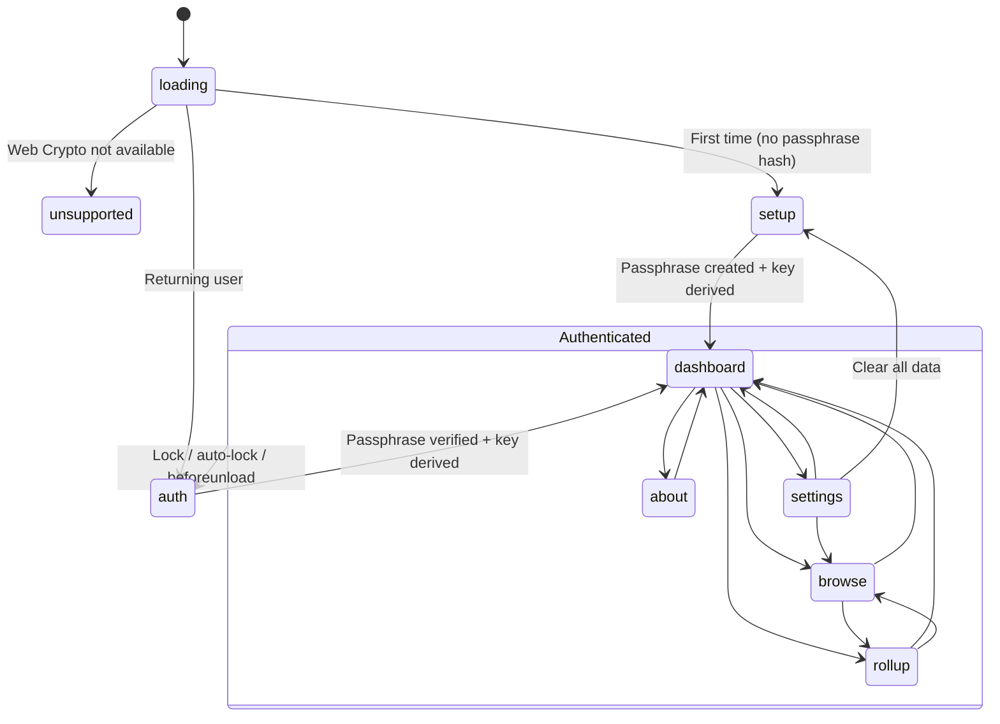

# Frontend Architecture

The entire application is a single Alpine.js component (`sdlcApp`) rendered within `index.html`. There is no routing library, no virtual DOM, and no component tree — Alpine.js directives in the HTML declaratively control what is visible based on the `view` state property.

## View State Machine

The application has a linear authentication flow and a flat navigation structure once authenticated. All state is managed in a single `Alpine.data('sdlcApp', ...)` object.

**Pre-auth states**: `loading`, `unsupported`, `setup`, `auth` — rendered via `<template x-if>` so they are fully removed from the DOM when inactive.

**Authenticated states**: `dashboard`, `browse`, `rollup`, `about`, `settings` — rendered via `
` with `x-transition` for smooth switching. These remain in the DOM but are hidden, which preserves scroll position and form state during navigation.

## Component Data Structure

The `sdlcApp` data object is organized into logical groups. Each group maps to a specific view or concern.

| Group | Key Properties | Purpose |
|-------|----------------|---------|
| State | `view`, `error`, `message`, `isProcessing` | Global UI state |
| Auth | `passphrase`, `passphraseConfirm`, `cryptoKey`, `isFirstTime` | Authentication flow |
| Dashboard | `todayDate`, `entryForm`, `hasEntryToday`, `recentEntries` | Daily entry form |
| Browse | `allEntryMetas`, `browseGroups`, `searchQuery`, `searchResults`, `selectedEntry`, `isEditing`, `editForm` | Entry browsing and search |
| Rollups | `rollupTab`, `availablePeriods`, `selectedPeriod`, `currentRollup`, `subReflections`, `reflectionText` | Period summaries |
| Settings | `storageEstimate`, `entryCount`, `showClearConfirm`, `clearConfirmText` | Data management |
| Session | `_lockTimer`, `_lastActivity` | Auto-lock timing |

## CSS Design System

The stylesheet uses CSS custom properties for consistent theming. All colors, spacing, and radii are defined in `:root` variables.

**Color palette** (Circle 6 Systems brand):

| Variable | Value | Usage |
|----------|-------|-------|
| `--navy` | `#0a192f` | Page background, input backgrounds |
| `--navy-light` | `#112240` | Card backgrounds, bottom nav |
| `--navy-lighter` | `#1d3461` | Borders, dividers |
| `--slate` | `#8892b0` | Secondary text, labels |
| `--slate-light` | `#a8b2d1` | Body text |
| `--lightest` | `#ccd6f6` | Headings, primary text |
| `--accent` | `#64ffda` | Interactive elements, links, highlights |

**SDLC category colors** — each journal category has a dedicated color pair for text/borders and translucent backgrounds:

| Category | Color | Background |
|----------|-------|------------|
| Success | `#64ffda` | `#64ffda15` |
| Delight | `#ffd764` | `#ffd76415` |
| Learning | `#64b5ff` | `#64b5ff15` |
| Compliment | `#ff64b5` | `#ff64b515` |

**Typography**: Headings use Georgia (serif); body text uses the system sans-serif stack (`-apple-system, BlinkMacSystemFont, 'Segoe UI', Roboto, ...`).

## Responsive Layout

The app uses a mobile-first approach with two breakpoints.

| Breakpoint | Layout Change |
|------------|---------------|
| < 640px | Bottom navigation bar (fixed); desktop nav hidden; tighter padding |
| 640px+ | Desktop pill navigation bar; bottom nav hidden; wider padding |
| 968px+ | Maximum content width (900px); most generous padding |

The bottom navigation on mobile uses a 5-button icon layout (Journal, Browse, Rollups, About, Settings) that mirrors the desktop nav bar. The `x-cloak` attribute hides all Alpine.js content until initialization completes, preventing a flash of unrendered template syntax.

## Accessibility

- **Focus management**: `:focus-visible` outlines using the accent color with 2px offset; non-keyboard focus suppressed on buttons
- **Screen reader support**: `.sr-only` utility class available for visually hidden labels
- **Reduced motion**: `prefers-reduced-motion: reduce` disables all animations and transitions
- **Contrast**: Text colors meet WCAG AA contrast ratios against the navy backgrounds
- **Semantic HTML**: Navigation uses `<nav>` with `aria-label`; form inputs have associated `<label>` elements
- **Print styles**: Navigation, buttons, and footer hidden; colors adjusted for paper output
